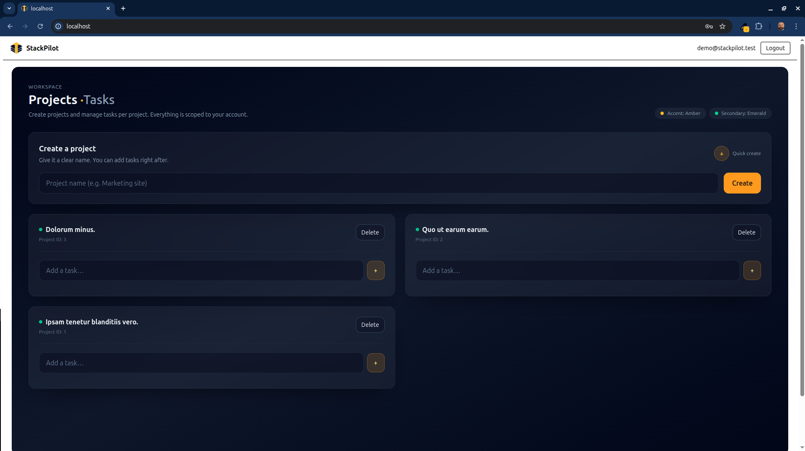

<p align="center">
  
</p>

# StackPilot

**StackPilot** is a full-stack Laravel + Vue 3 project management application focused on clean UI, secure REST APIs, and modern SPA architecture.

It demonstrates real-world patterns including authentication, authorization, state management, and a structured project/task workflow with a polished dashboard interface.

---

## 🚀 Features

### Authentication & Security
- User registration, login, logout
- Token-based authentication with Laravel Sanctum
- Authorization policies (user-owned resources)
- Protected API routes

### Projects
- Create and delete projects
- Project descriptions
- User-scoped project access

### Tasks
- Create tasks per project with:
  - title
  - description
  - status (`todo`, `doing`, `done`)
  - due date
- Toggle task status (cycle: todo → doing → done)
- Delete tasks
- Tasks grouped per project

### UI / UX
- Clean dark dashboard UI (Tailwind CSS)
- Collapsible task details panel
- Status badges (Todo / Doing / Done)
- Due date display
- Loading and empty states
- Inline creation forms (no page reloads)

### Architecture
- Vue 3 SPA with Pinia state management
- RESTful Laravel API with Resources
- Optimistic UI updates
- Modular store structure

### Development
- Docker-based local environment (Laravel Sail)
- Seeded demo data
- Pagination-ready API structure

---

## 🛠 Tech Stack

- **Backend:** Laravel, Sanctum, Eloquent ORM  
- **Frontend:** Vue 3, Vue Router, Pinia, Tailwind CSS, Vite  
- **Database:** MySQL  
- **Dev Environment:** Docker (Laravel Sail)  
- **Tools:** Composer, npm, DBeaver  

---

## 📦 Installation

```bash
# Clone repository
git clone https://github.com/damir-bubanovic/StackPilot.git
cd StackPilot

# Copy environment file
cp .env.example .env

# Start containers
./vendor/bin/sail up -d

# Install backend dependencies
./vendor/bin/sail composer install

# Generate application key
./vendor/bin/sail artisan key:generate

# Run migrations + seed demo data
./vendor/bin/sail artisan migrate:fresh --seed

# Install frontend dependencies
./vendor/bin/sail npm install

# Start Vite dev server
./vendor/bin/sail npm run dev